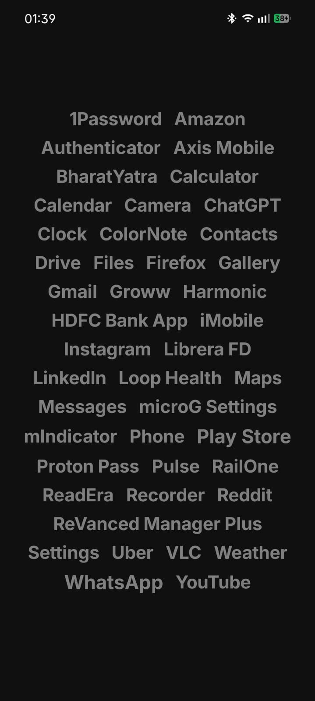
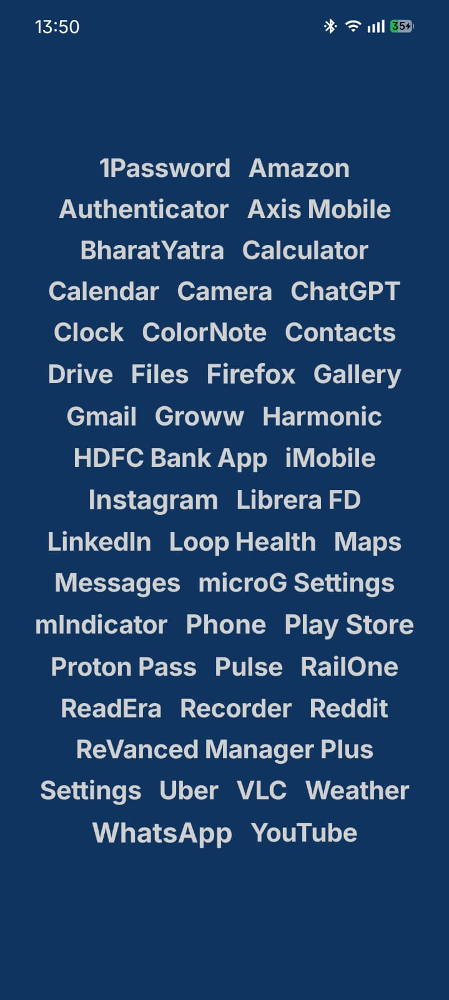
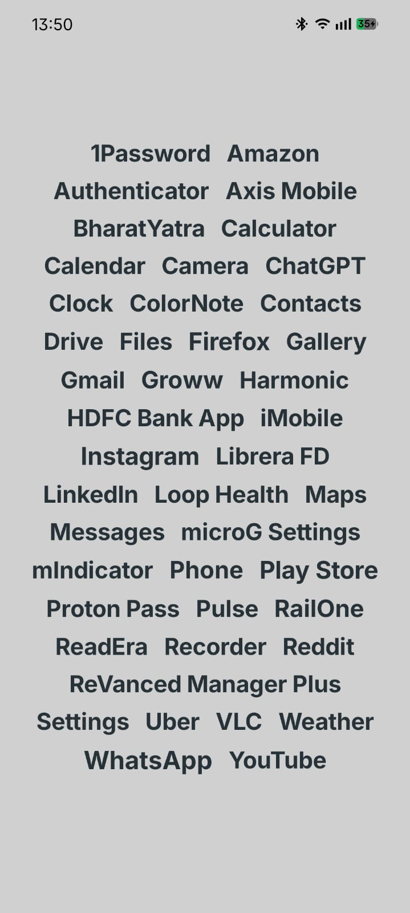
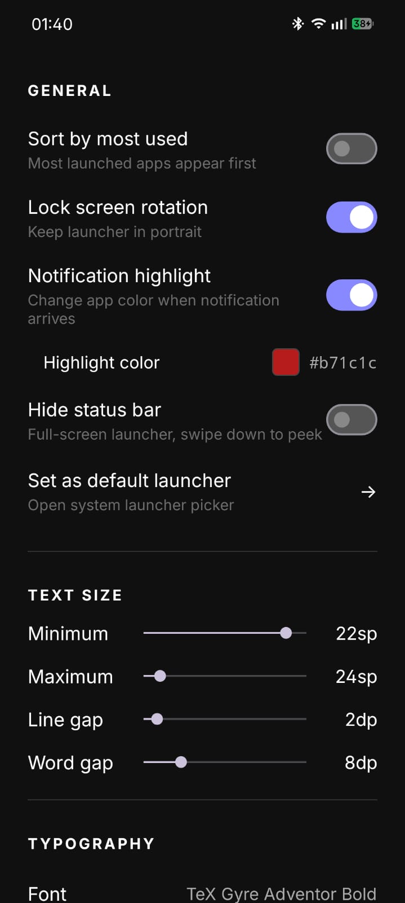
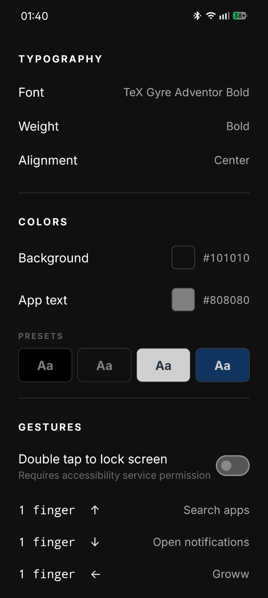

# Slate — Minimal Android Launcher

A text-only Android home screen built for focus. No icons, no widgets, no algorithmic feeds competing for your attention — just your apps, listed by name.

---

## Screenshots

  
  
  
  
  

---

## Why Slate Exists

Most launchers are designed to keep you on your phone. Colorful icons trigger recognition without thought, notification badges create artificial urgency, and recommendation widgets are optimized for engagement rather than intent.

Slate removes all of that. It presents your apps as plain text — the same way a to-do list presents tasks. You open the app you meant to open, not the one that looked most appealing. Over time this creates a subtle shift: phone use becomes more deliberate and less reflexive.

---

## Features

**Appearance**
- Fully customizable background and text colors with a live color picker
- Apply background to lockscreen — sets your lockscreen wallpaper to the launcher's solid background color for a uniform look
- Per-app color overrides — highlight only what matters
- Typography control: font family (including Google Fonts + import your own), weight, line spacing, word spacing
- Font size scales with app name length — frequently used apps appear larger
- Hide the status bar for a true full-screen experience

**Interaction**
- Swipe up to search apps
- Configurable single, two, and three-finger swipe gestures (open any app, notifications, Wi-Fi, Bluetooth, location, and more)
- Double-tap to lock screen (requires device admin)
- Long-press an app for per-app options (hide, custom color, info)
- Long-press the homescreen to access customization or manage hidden apps
- Sort apps alphabetically or by most recently used

**Control**
- Lock screen rotation to portrait
- Optional persistent search bar on the home screen
- Export and import all settings as a JSON backup
- Onboarding with dark and light preset themes

---

## Privacy

Slate does not collect, transmit, or share any data. There is no analytics, no crash reporting, and no network activity of any kind.

All preferences are stored locally using Android's `SharedPreferences`. App usage counts (for sort-by-usage) never leave the device.

The app requests only the permissions it actively uses:
- `EXPAND_STATUS_BAR` — swipe-down gesture to expand the notification panel
- `ACCESS_WIFI_STATE` / `CHANGE_WIFI_STATE` — Wi-Fi gesture toggle (Android 10+: opens the system internet panel; Android 9 and below: toggles Wi-Fi directly)
- `BLUETOOTH` / `BLUETOOTH_ADMIN` — Bluetooth gesture toggle on Android 11 and below only; not requested on Android 12+
- `QUERY_ALL_PACKAGES` — required on Android 11+ to enumerate all installed apps so they appear in the launcher
- `REQUEST_DELETE_PACKAGES` — opens the system uninstall confirmation dialog when you choose to uninstall an app from the long-press menu
- `BIND_ACCESSIBILITY_SERVICE` — declared by the optional accessibility service used solely to lock the screen on double-tap; grants no ability to read screen content or monitor usage
- `BIND_NOTIFICATION_LISTENER_SERVICE` — declared by the optional notification listener used solely to know which apps have a pending notification, enabling the notification highlight color feature; notification content is never read or stored
- `SET_WALLPAPER` — used only when the "Apply to lockscreen" toggle is enabled, to set a solid-color wallpaper on the lock screen matching the launcher's background color; never triggered without explicit user action

---

## Privacy Policy

See [PRIVACY_POLICY.md](PRIVACY_POLICY.md) for the full policy.

---

## License

MIT License. See [LICENSE](LICENSE) for details.
