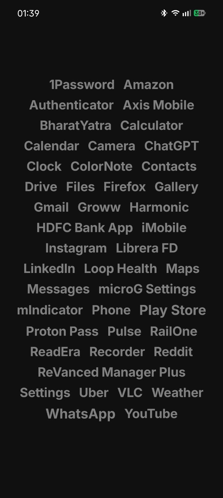
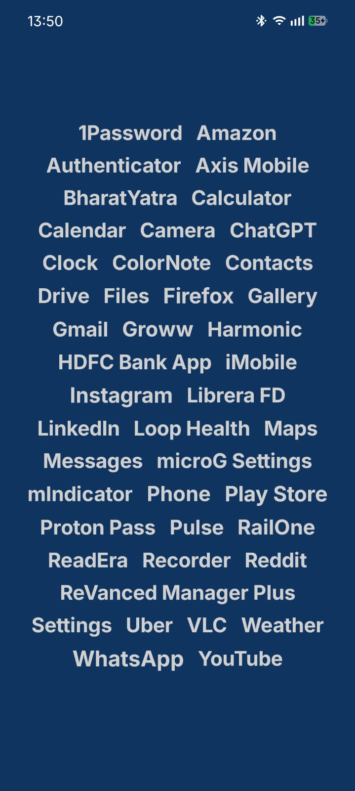
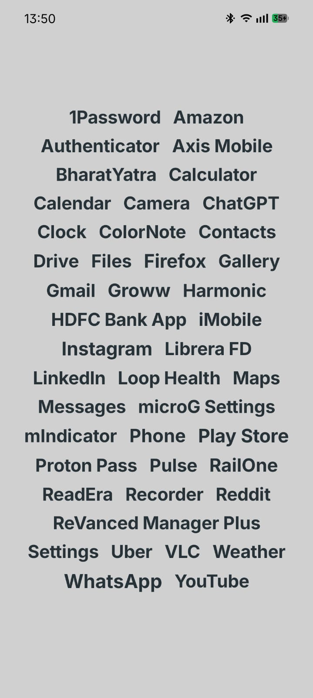
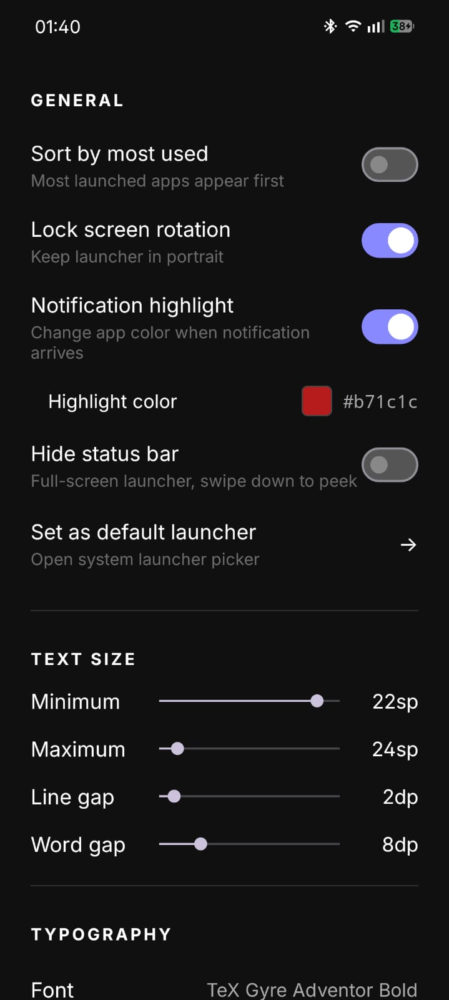
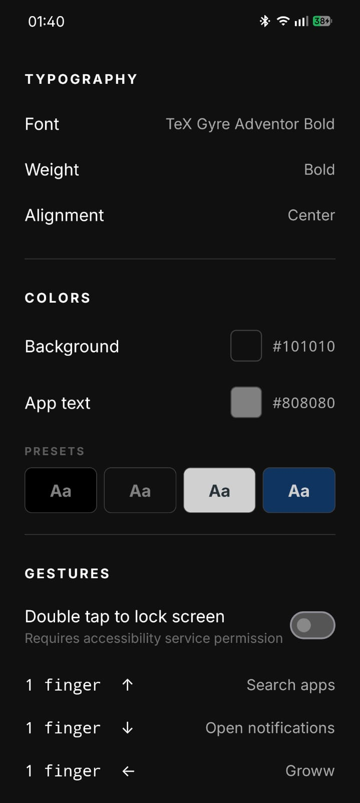

# Slate - Minimal Android Launcher

A text-only Android home screen built for focus. No icons. No app drawers. No algorithmic feeds - just your apps, listed by name, with an optional row of quick toggles.

**Website:** [roufsyed.github.io/Slate-Minimal-Launcher](https://roufsyed.github.io/Slate-Minimal-Launcher/)

---

## Screenshots

  
  
  
  
  

---

## Why Slate Exists

Most launchers are designed to keep you on your phone. Colorful icons trigger recognition without thought, notification badges create artificial urgency, and recommendation widgets are optimized for engagement rather than intent.

Slate removes all of that. It presents your apps as plain text - the same way a to-do list presents tasks. You open the app you meant to open, not the one that looked most appealing. Over time this creates a subtle shift: phone use becomes more deliberate and less reflexive.

---

## Features

**Appearance**
- Two homescreen layouts - Flow (apps wrap like text, sized by usage) or Minimal List (one app per line with optional side alphabetical fast-scroll)
- Fully customizable background and text colors with a live color picker
- Follow system theme - automatically switches between dark and light colors based on system dark mode
- Apply background to lockscreen - sets your lockscreen wallpaper to the launcher's solid background color for a uniform look
- Per-app color overrides - highlight only what matters
- Notification highlight - app names change color when they have a pending notification
- Typography control: font family (including Google Fonts + import your own), weight, line spacing, word spacing
- Font size scales with usage in Flow view - frequently used apps appear larger
- Hide the status bar for a true full-screen experience

**Interaction**
- Swipe up to search apps
- Configurable single-finger swipe gestures (open any app, notifications, Wi-Fi, Bluetooth, location, camera, and more)
- Double-tap to lock screen (uses accessibility service)
- Long-press an app for per-app options (pin to top, app info, hide, uninstall, move to folder, custom color, rename)
- Long-press the homescreen to access customization or manage hidden apps
- Pin apps to the top of the list regardless of sort order
- Sort apps alphabetically or by most used
- Group apps into custom folders - each folder is a text label with a `›` chevron; tap to expand inline (with a `‹ back` row), long-press the folder to rename, recolor, or delete. Apps inside a folder are hidden from the main list to reduce home-screen clutter; search still finds them globally
- Optional quick-toggles strip - a row of text widgets at the top or bottom of the home screen showing Clock, Date, Next alarm, Battery %, Time to full, Wi-Fi, Bluetooth, Mobile data, DND, Volume, Brightness, Torch, and more. Off by default; pick which widgets, where they sit, and how they look from Settings → Quick toggles
- Optional contact search - turn on Settings → Search → "Search contacts" to surface matching contacts inline with apps when you type. Read-only at search time, never stored. Tapping opens the dialer prepopulated with the contact's number. Includes a "Google contacts only" sub-toggle to skip duplicates from WhatsApp / Telegram / SIM / other sources
- Optional direct-call contact widgets - pin a contact to the quick-toggles strip for one-tap dial or text. With Direct call enabled in Settings, tapping places the call immediately; otherwise it opens the dialer

**Control**
- Lock screen rotation to portrait
- Optional persistent search bar on the home screen
- Lock the hidden apps list behind a PIN (4–8 digits, PBKDF2-hashed) with optional biometric unlock. Hidden-app launches are also excluded by default from the Android Recents (Overview) screen so the launched app doesn't leak through there, with an opt-out for people who need those apps to survive switching away
- Export and import all settings as a JSON backup. Hidden-apps list, PIN hash, and biometric setting are omitted by default - opt in via Settings → Backup → "Include hidden apps in backups". On import, the backup's PIN is verified in-memory before any hidden-apps data is written; three wrong PIN attempts refuse the entire import
- Import settings during onboarding for returning users

---

## Privacy

Slate does not collect, transmit, or share any data. There is no analytics, no crash reporting, and no network activity of any kind.

All preferences are stored locally using Android's `SharedPreferences`. App usage counts (for sort-by-usage) never leave the device.

The app requests only the permissions it actively uses:
- `EXPAND_STATUS_BAR` - swipe-down gesture to expand the notification panel
- `ACCESS_WIFI_STATE` / `CHANGE_WIFI_STATE` - Wi-Fi gesture toggle (Android 10+: opens the system internet panel; Android 9 and below: toggles Wi-Fi directly)
- `BLUETOOTH` / `BLUETOOTH_ADMIN` - Bluetooth gesture toggle on Android 11 and below only; not requested on Android 12+
- `QUERY_ALL_PACKAGES` - required on Android 11+ to enumerate all installed apps so they appear in the launcher
- `REQUEST_DELETE_PACKAGES` - opens the system uninstall confirmation dialog when you choose to uninstall an app from the long-press menu
- `BIND_ACCESSIBILITY_SERVICE` - declared by the optional accessibility service used solely to lock the screen on double-tap; grants no ability to read screen content or monitor usage
- `BIND_NOTIFICATION_LISTENER_SERVICE` - declared by the optional notification listener used solely to know which apps have a pending notification, enabling the notification highlight color feature; notification content is never read or stored
- `SET_WALLPAPER` - used only when the "Apply to lockscreen" toggle is enabled, to set a solid-color wallpaper on the lock screen matching the launcher's background color; never triggered without explicit user action
- `REQUEST_IGNORE_BATTERY_OPTIMIZATIONS` - used only to show a system dialog asking you to exempt Slate from battery optimization, so features like notification highlight and double-tap to lock continue working reliably in the background; only triggered when you tap "Fix this" on the battery restriction warning banner
- `USE_BIOMETRIC` - declared by the AndroidX Biometric library and only requested when you opt into biometric unlock for hidden apps in Settings → Security. Biometric data is handled by the OS via `BiometricPrompt`; Slate only receives a success/fail signal.
- `READ_CONTACTS` - declared but never exercised by default. Only requested at runtime when you explicitly enable "Search contacts" under Settings → Search, after an in-app consent dialog explains the contract. Contacts are queried at the moment you type a search query, filtered in memory, and discarded immediately. Never stored, indexed, or transmitted.
- `CALL_PHONE` - declared but never exercised by default. Only requested at runtime when you explicitly enable "Direct call" under Settings → Quick toggles → Direct call. With the setting off, tapping a contact shortcut opens the dialer (`ACTION_DIAL`) without placing the call.
- `READ_BASIC_PHONE_STATE` - declared as a "normal" permission (no runtime prompt) for the Mobile data quick-toggle widget on Android 13+. Reads only whether mobile data is enabled and whether a SIM is ready. On older Android the widget hides itself.

Slate also declares `<uses-feature android:name="android.hardware.telephony" android:required="false">`. Telephony hardware is explicitly marked optional so Slate can install on tablets, Chromebooks, and other devices that lack a cellular radio - without this declaration, Google Play would implicitly require telephony because of the `CALL_PHONE` permission and filter Slate off those devices.

---

## Privacy Policy

See [PRIVACY_POLICY.md](PRIVACY_POLICY.md) for the full policy.

---

## License

MIT License. See [LICENSE](LICENSE) for details.
